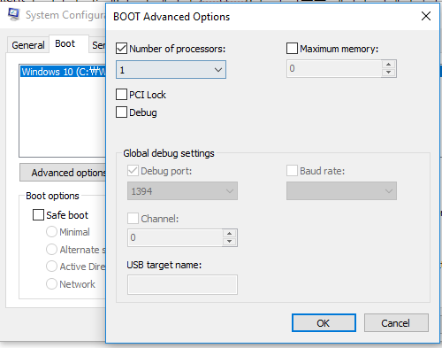
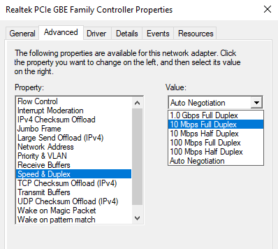

### Make PC Slower

#### Disable CPU Core

Run -> msconfig -> Boot -> Advanced options -> Check Number of processors to 1

#### Network speed setting

Open Device Manager -> Network adapters -> Select network controller and double click.

Select Advanced tab -> Speed & Duplex -> Select 10Mbps or 100Mbps
