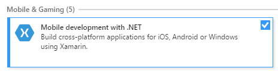

## Introduction Xamarin Development

모바일 개발 방법

1. iOS를 위해 ObjectC로 개발, Android를 위해 Eclipse Java로 개발

2. HTML/Javascript로 작성 후 Convert

3. Xamarin을 이용해 C#으로 Native App을 개발

Xamarin 개발 환경
- Visual Studio를 이용해 개발
- 기타 Xamarin Studio등을 이용해 개발

Xamarin 설치

- Windows : Visual Studio 2017 설치 또는 Xamarin Installer로 설치
    - Visual Studio About페이지에서 Xamarin 설치된 것을 확인할 수 있음.

- Mac : Xcode 설치 후 Xamarin Installer 설치

Visual Studio에 Xamarin 설치

- 설치 옵션에서 Mobile development with .NET에 체크함

Visual Studio에서 앱 개발

- iOS앱 개발을 위해서는 Mac 이 필요함. Mac에 원격 접속하여 리모트 디버깅하게 됨.

  - Tools -> iOS -> Xamarin Mac Agent 선택하여 원격 Mac에 연결.

  - Mac에서는 System Preferences -> Sharing에서 Remote Login을 체크한 후 사용자 설정함.

- Android및 Windows Phone은 Visual Studio에서 에뮬레이터 제공함.

